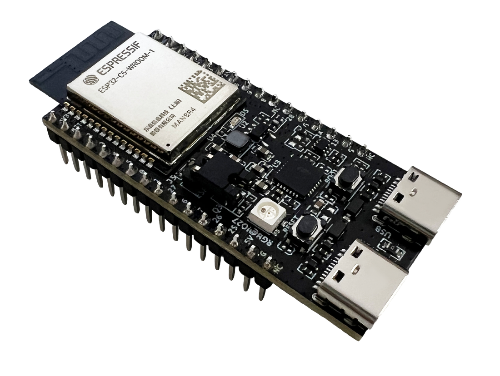
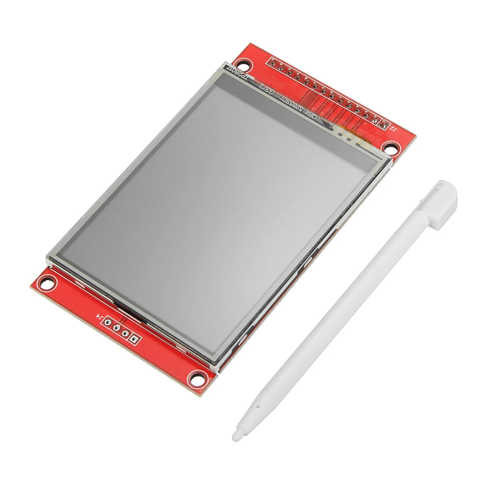
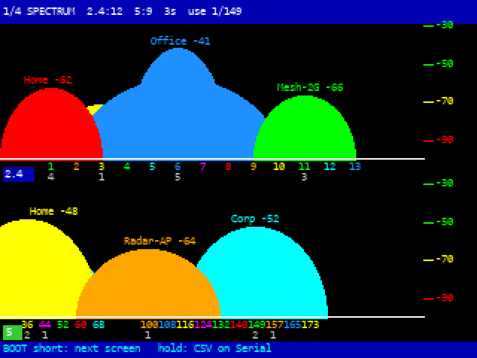
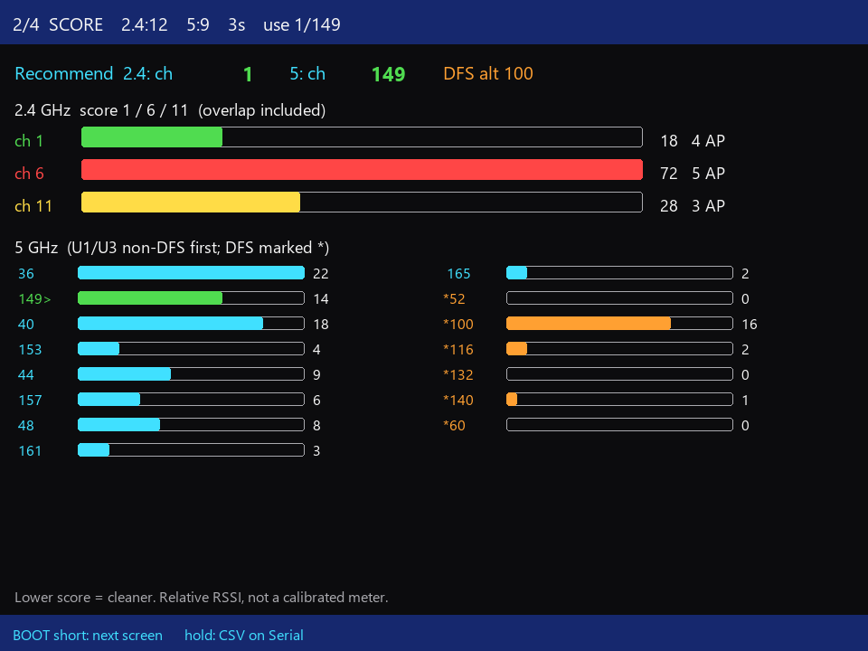
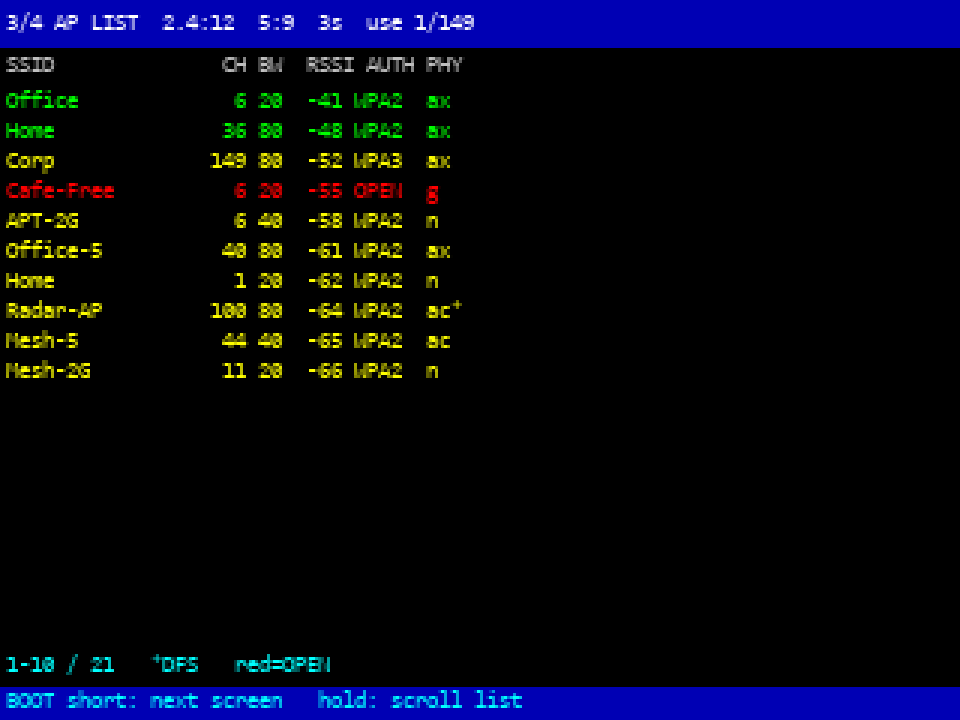
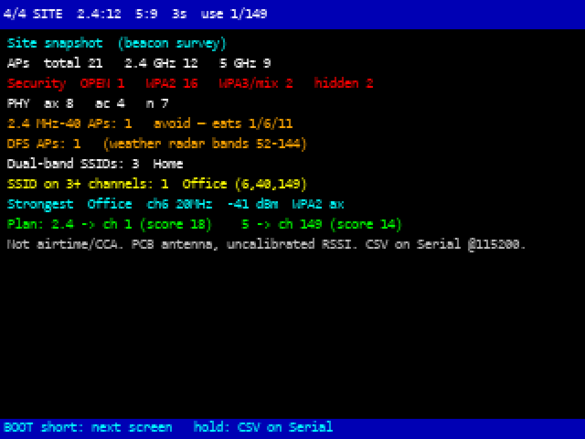
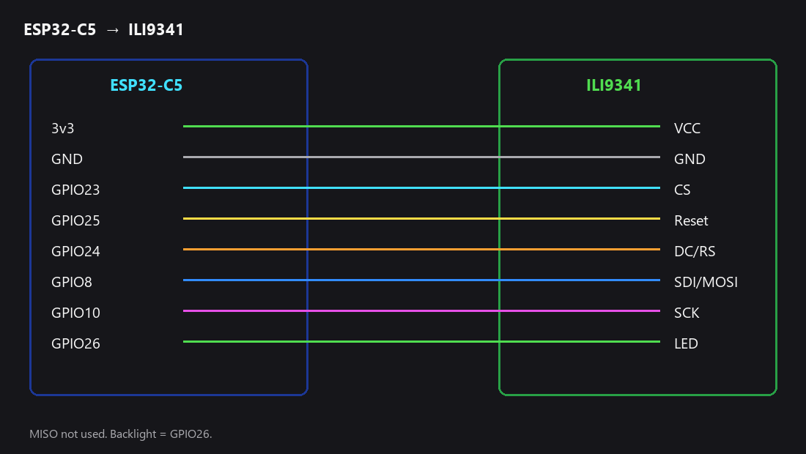

# Dual Band Wi-Fi Analyser

The Hardware: ESP32-C5 board plus an ILI9341 screen, jumper cables and a breadboard to mount ESP32 and Screen. 
Use: Walk around, see what’s on 2.4 GHz and 5 GHz, pick a quieter channel. That’s the whole point.

This started from moononournation’s analyzer on [Instructables](https://www.instructables.com/ESP32-C5-Dual-Band-WiFi-Analyzer/). **[Dual Band Wi-Fi Analyser v2.0](Dual%20Band%20Wi-Fi%20Analyser%20v2.0/)** is the firmware in this repo (four screens, channel scores, AP list, a short site summary). **[Dual Band Wi-Fi Analyser v1.0](Dual%20Band%20Wi-Fi%20Analyser%20v1.0/)** is basically that original project from Instructables, with some UI tweaks made for better useability.

How to wire it, what parts you need, and how to flash it from Arduino IDE: **[USER_MANUAL.md](USER_MANUAL.md)**

 
<em>ESP32-C5-DevKitC-1. Photo from <a href="https://docs.espressif.com/projects/esp-dev-kits/en/latest/esp32c5/esp32-c5-devkitc-1/user_guide.html">Espressif’s DevKitC-1 user guide</a>.</em>

 
<em>Typical ILI9341 SPI module (320×240). Photo from <a href="https://imgaz1.staticbg.com/thumb/large/oaupload/banggood/images/DE/26/ebb27e89-c2b9-4de0-8488-37da3f1b2651.JPG.webp">Banggood / staticbg</a>. SDO/MISO is unused here.</em>

## Dual Band Wi-Fi Analyser v2.0 in short

After it boots, tap **BOOT** to flip screens (spectrum → score → AP list → site). Hold BOOT on the list to scroll; on the other screens it dumps CSV over serial at 115200.

**Spectrum**

 <em>Firmware UI mockup (spectrum).</em>

**Score**

 <em>Firmware UI mockup (score).</em>

**AP list**

 <em>Firmware UI mockup (AP list).</em>

**Site**

 <em>Firmware UI mockup (site snapshot).</em>

Arduino settings that actually work on this hardware : under tools menu in Arduino IDE.

- Board: ESP32 → ESP32C5, package **3.3.1 or later**
- Flash size **16MB**
- Upload speed **921600**
- Partition: **Huge APP (3MB No OTA)**
- Libraries: [GFX Library for Arduino](https://github.com/moononournation/Arduino_GFX) (moononournation) and [U8g2](https://github.com/olikraus/u8g2) (olikraus)

Put the board in download mode first if upload fails: hold BOOT, tap RESET, let go of BOOT.

 <em>Wiring diagram for this project.  SDO/MISO unused.</em>

## What’s in this folder

- [`Dual Band Wi-Fi Analyser v2.0/`](Dual%20Band%20Wi-Fi%20Analyser%20v2.0/) — current firmware. Open [`Dual Band Wi-Fi Analyser v2.0.ino`](Dual%20Band%20Wi-Fi%20Analyser%20v2.0/Dual%20Band%20Wi-Fi%20Analyser%20v2.0.ino) in Arduino IDE.
- [`USER_MANUAL.md`](USER_MANUAL.md) — parts, wiring, flashing, how the screens work
- `docs/images/` — board photos, wiring diagram, and screen mockups
- [`Dual Band Wi-Fi Analyser v1.0/`](Dual%20Band%20Wi-Fi%20Analyser%20v1.0/) — v1.0 sketch (original Instructables analyzer, with some UI tweaks). Open [`Dual Band Wi-Fi Analyser v1.0.ino`](Dual%20Band%20Wi-Fi%20Analyser%20v1.0/Dual%20Band%20Wi-Fi%20Analyser%20v1.0.ino).
- `ESP32C5WiFiAnalyzerUTF8_1.ino` — extra v1 copy at repo root (open the v1.0 folder in Arduino IDE, not this file)
- `Readme.txt` — original hardware / pin notes
- `firmware` — leftover placeholder from the first repo upload; not used by v2.0

## Image credits

- ESP32-C5 board: [Espressif ESP32-C5-DevKitC-1 user guide](https://docs.espressif.com/projects/esp-dev-kits/en/latest/esp32c5/esp32-c5-devkitc-1/user_guide.html)
- ILI9341 module: [Banggood / staticbg photo](https://imgaz1.staticbg.com/thumb/large/oaupload/banggood/images/DE/26/ebb27e89-c2b9-4de0-8488-37da3f1b2651.JPG.webp) (typical SPI 320×240 module)
- Spectrum / score / AP list / site screens: UI mockups of Dual Band Wi-Fi Analyser v2.0, not photos of hardware
- wiring.png: pin diagram for this project (3v3–VCC, GND, GPIO23–CS, GPIO25–Reset, GPIO24–DC/RS, GPIO8–SDI/MOSI, GPIO10–SCK, GPIO26–LED)
