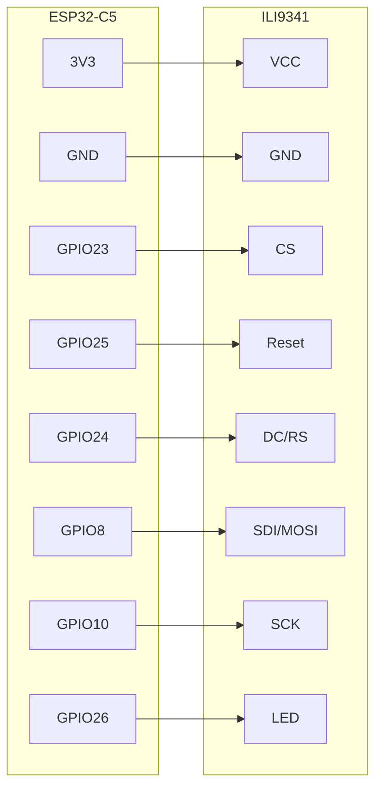

# User manual (v2.0)

ESP32-C5 + ILI9341. It scans 2.4 and 5 GHz and draws what it heard. It does not join your Wi-Fi, and it is not a calibrated meter. RSSI moves if you turn the board or stand in front of the antenna. Treat it as a walk-around tool, then confirm with something proper if the design actually matters.

Based on the [Instructables ESP32-C5 Dual Band WiFi Analyzer](https://www.instructables.com/ESP32-C5-Dual-Band-WiFi-Analyzer/). Wiring and Arduino settings below are the same ones from the original `Readme.txt`.

---

## Parts

You need:

- An **ESP32-C5** board (DevKitC-1 or similar). Dual-band, no 6 GHz.
- An **ILI9341** SPI TFT, 320×240. Touch is not used.
- Jumpers
- USB cable (power + upload)
- Arduino IDE on the PC

Libraries from Library Manager:

- **GFX Library for Arduino** — moononournation
- **U8g2** — olikraus

A power bank is handy if you are walking a floor.

---

## Wiring

Feed the panel from **3V3**, not 5V, unless you are sure the module is 5V-safe *and* the SPI lines stay at 3.3V.

```
ESP32-C5    ILI9341
========    =======
3v3      -> VCC
GND      -> GND
GPIO23   -> CS
GPIO25   -> Reset
GPIO24   -> DC/RS
GPIO8    -> SDI/MOSI
GPIO10   -> SCK
GPIO26   -> LED
```

Leave MISO / SDO unconnected. There is no touch wiring.



On a DevKitC-1, **BOOT is GPIO28**. After the firmware is running, a short press changes screen. If you hold BOOT and hit RESET, you are back in download mode — that’s only for flashing.

If you want a spare button, GPIO0 to GND does the same thing as BOOT while the sketch is running.

---

## What the screens do

Short-press BOOT. The bar at the top stays put: page name, how many APs on 2.4 vs 5, how old the scan is, and a suggested pair like `use 1/149`.

**Spectrum** — the old-style graph, two bands. Blob width follows 20 / 40 / 80 MHz so an 80 MHz AP actually looks wide. Numbers under the channels are AP counts. Only a few SSIDs get labeled (the strong ones), otherwise the 5 GHz plot turns into mush. RSSI ticks on the right: −30, −50, −70, −90.

**Score** — this is the planner page. 2.4 GHz only really scores **1 / 6 / 11**, with overlap from the in-between channels counted in. 5 GHz is UNII channels; DFS ones have a `*`. Lower score is cleaner.

**AP list** — one line per BSS: name, channel, width, RSSI, auth, phy (`ax` / `ac` / `n`). Strongest first. Open networks in red. Hidden ones show as `*` plus the last part of the BSSID. Hold BOOT to scroll.

**Site** — counts: open / WPA2 / WPA3, hidden, 40 MHz on 2.4 (that’s a problem), DFS APs, SSIDs that exist on both bands, SSIDs spread across many channels, strongest AP, and the suggested 2.4 / 5 channels.

Long-press BOOT on spectrum / score / site reprints the CSV on serial (115200). Columns: `bssid,ssid,band,channel,bw_mhz,rssi,auth,phy,dfs,unii`

Scans are about every 3 seconds, 400 ms dwell, both bands, hidden included. If a scan comes back empty, the last good picture stays on the screen.

This is beacons and probe responses, not airtime. Fine for “don’t put the new AP on 6”, not a substitute for a spectrum analyzer.

---

## Flashing with Arduino IDE

Same recipe as the original text file: C5 board package 3.3.1+, 16MB flash, 921600, Huge APP, GFX + u8g2.

**Once on the PC**

Install [Arduino IDE](https://www.arduino.cc/en/software). Under File → Preferences, add this URL if ESP32 isn’t there yet:

`https://espressif.github.io/arduino-esp32/package_esp32_index.json`

Boards Manager: search **esp32** (Espressif) and install **3.3.1 or later**. The old note said “33.1 onwards” — that’s this package.

Then Library Manager: **GFX Library for Arduino** (moononournation) and **U8g2**.

**Open the right sketch**

File → Open → `ESP32C5_WiFi_Planner/ESP32C5_WiFi_Planner.ino`

That’s v2.0. The other folder is the original one-screen sketch. Don’t open both in the same IDE window or Arduino will glue the `.ino` files together.

**Download mode**

Plug in USB. If the port is missing or upload dies, hold **BOOT**, tap **RESET**, release BOOT. Then pick the COM port under Tools → Port.

**Tools menu**

| Setting | Value |
|---------|--------|
| Board | ESP32 → ESP32C5 Dev Module (or ESP32C5) |
| Flash Size | 16MB |
| Upload Speed | 921600 |
| Partition Scheme | Huge APP (3MB No OTA) |

Verify, then Upload. If the screen stays black after “Hard resetting via RTS”, tap RESET. You should get “ESP32-C5 Wi-Fi Planner” and then the spectrum after the first scan.

Serial Monitor at **115200** if you want the CSV.

---

## Using it on site

Power from USB. Backlight is GPIO26 — if that’s dark, the LED pin isn’t hooked up. Give it a few seconds for the first dual-band scan. Walk. Look at Score for the suggested channels, then the AP list if you need names and widths. Don’t obsess over a 3 dB RSSI change; the antenna isn’t calibrated.

---

## If something’s wrong

Blank screen: check CS / DC / RST / MOSI / SCK, 3V3, GND, and GPIO26 → LED.

Upload failed: download mode, right COM port, a cable that actually has data, Serial Monitor closed.

Compile complaining about 5 GHz or the wrong chip: you didn’t select ESP32C5, or the board package is older than 3.3.1.

Sketch too big: Huge APP + 16MB flash. That’s not optional on this build.

Garbage on the LCD: confirm it’s really an ILI9341, not an ST7789 with the same pin header.

BOOT does nothing after boot: DevKit uses GPIO28. Don’t hold BOOT at reset. GPIO0 is the backup button.

No APs: wait for a full scan. 5 GHz dies quickly through walls.

Only scan networks you’re supposed to be looking at. C5 has no 6 GHz. DFS (52–144) can vanish in real life when radar detection kicks in.

---

## Versions

- **1.x** — `ESP32C5WiFiAnalyzerUTF8`, one screen, the original ellipse plot
- **2.0** — `ESP32C5_WiFi_Planner`, four screens, scoring, list, site page, CSV
